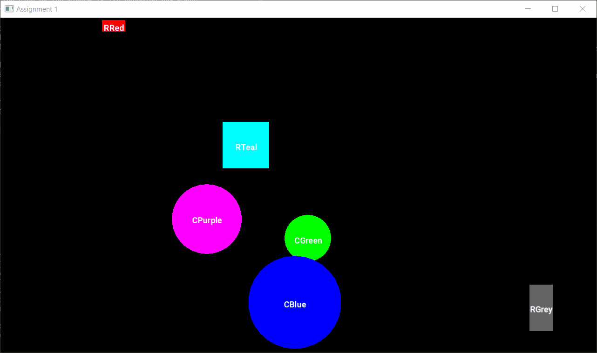
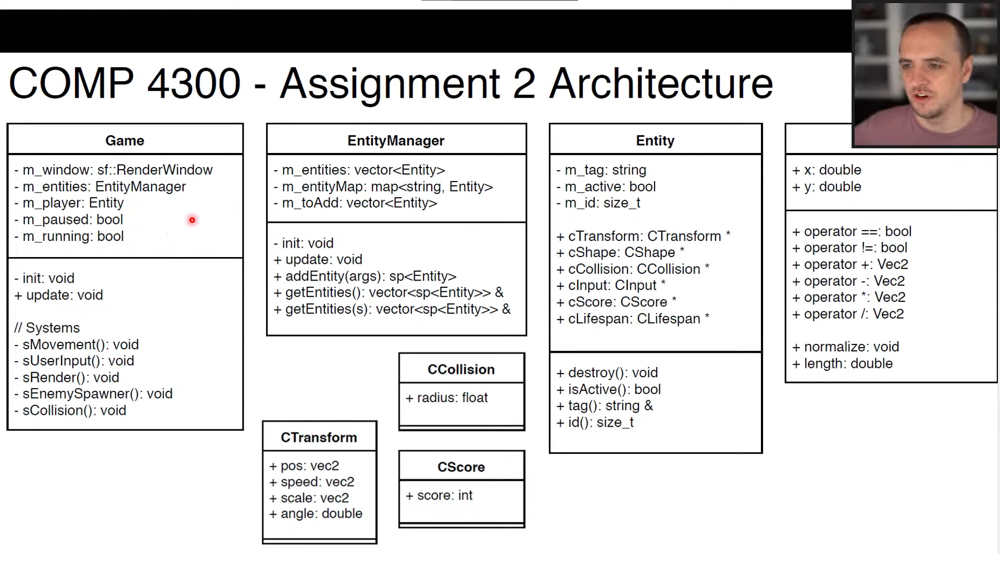

# Studying the COMP4300 - Game Programming Course

### Spreadsheet

https://docs.google.com/spreadsheets/d/1pf7QuMVnK-HVtdF63RUkaFSkfQY0Um4SP8Ye_p2Slbo/edit#gid=0

### Youtube Playlist

https://youtube.com/playlist?list=PL_xRyXins848nDj2v-TJYahzvs-XW9sVV&si=WL8a0rqQtCWxXA8w

## Assignment 1 - Intro to SFML/C++

Program Specification
---------------------------------------------------------------------------------

In this assignment you will be writing a C++/SFML program which will read
descriptions of shapes from a configuration file, and then drawing those shapes
to the screen. Each shape will have a name, position, speed, color, as well as
properties unique to each shape type. For example, a Rectangle will have width
and height, and a circle will have a Radius. For this assignment, the position
of a shape refers to its SFML default of the upper-left corner of the shape.

You are also required to make these shapes "bounce" off the sides of the window
which contains them. This means that if the shape's left side hits the left side
of the window, its X speed reverses. If the top of the shape hits the top of the
window, its Y speed reverses. Smilarly, if it hits the right side or bottom of
the window. You can assume that all shapes will always be configured to start
entirely within the window, and you don't have to worry about what happens if
they start outside the window. Each shape's name should be drawn on the exact
center of the shape in the given font size and color specified in the file.
note: this may be the trickiest part of the assignment, you will not lose many
marks if It's not the exact center

A sample configuration file is given to you in config.txt, however marking will
be done with an unseen configuration file in order to test more completely. Be
sure to add and remove your own shapes to this file to test if they all work
correctly

Each line of the configuration file specifies one of the config settings of the
assignment program, with the first string in each line being the type of setting
that the rest of the line specified. Lines in the config file can be one of the
following types, and lines can appear in any order in the file.

Window W H
 - This line declares that the SFML Window must be constructed
   with width W and height H, each of which will be integers

Font F S R G B
 - This lines defines the font which is to be used to draw text for this program. 
   The format of the line is as follows:
   
   Font File           F          std::string (it will have no spaces) 
   Font Size           S          int 
   RGB Color           (R,G,B)    int, int, int 

Rectangle N X Y SX SY R G B W H
 - Defines a RectangleShape with:

   Shape Name          N          std::string 
   Initial Position    (X,Y)      float, float 
   Initial Speed       (SX,SY)    float, float 
   RGB Color           (R,G,B)    int, int, int 
   Size                (W,H)      float, float 

Circle N X Y SX SY R G B R
 - Defines a CircleShape with:
   
   Shape Name          N          std::string 
   Initial Position    (X,Y)      float, float 
   Initial Speed       (SX,SY)    float, float 
   RGB Color           (R,G,B)    int, int, int 
   Radius              R          float 

Hints
---------------------------------------------------------------------------------

 - In order to stare an arbitrary number of shapes from the configuration file,
   you must store them in a container - std vector is recommended.

 - A shape will 'touch' the side of the window if its bounding box makes 
   contact with it. Each shape's bounding rectangle can be obtained via: shape.getlocalBounds(); // .top, .left, .width, .height
    - gives the LOCAL position of the (top, left) of the rectangle
    - LOCAL pos means it is relative to shape.getPosition(), not the window
    - as well as the (width, height) size of the rectangle

 - Similarly, a sf::Text element's bounding rectangle can also be
   retrieved via text.getlocalBounds(), which you will need to use to 
   center the text properly within a shape. 
   
 - Please use C++ file reading (std::ifstream makes this easy) rather 
   than C-style FILE reading. You will lose marks for using older c functions!

### Result

## Assignment 2 - Geometry Wars
Proposed Architecture
---------------------------------------------------------------------------------

Program Specification
---------------------------------------------------------------------------------

In this assignment you will be writing the game that was presented in class.
This game must have the following features:

Player:
 - The player is represented by a shape which is defined in the config file
 - The player must spawn in the center of the screen at the beginning of the 
   game, and after it dies (collides with an enemy)
 - The player moves by a speed read from the config file in these directions:
  - Up: W key
  - Left: A key
  - Down: S key
  - Right: D key
 - The player is confined to move only within the bounds of the window
 - The player will shoot a bullet toward the mouse pointer when the left mouse 
 button is clicked. 
 - The speed, size, and lifespan of the bullets are read from the config file.

Special Ability:
 - You are free to come up with your own 'special move' which is fired by
 the player when the right mouse button is clicked. This special ability must:
  - Multiple entities (bullets etc) spawned by special weapon
  - Entities have some unique graphic associate with them
  - A unique game mechanic is introduced via a new component
  - A 'cooldown timer' must be implemented for the special weapon
 - The properties of the special move are not in the config file.

Enemy(s):
 - Enemies will spawn in a random location on the screen every X frames,
   where X is defined in the configuration file,
 - Enemies must not overlap the sides of the screen at the time of spawn
 - Enemies shapes have random number of vertices, between a given minimum and 
   maximum number, which is specified in the config file.
 - Enemy shape radius will be specified in the configuration file.
 - Enemies will be given a random color upon spawning.
 - Enemies will be given a random speed upon spawning, between a minimum and
   maximum value specified in the config file.
 - When an enemy reaches the edge of the window, it should bounce off in
   the opposite direction at the same speed.
 - When (large) enemies collide with a bullet or player, they are destroyed.
   and N small enemies spawn in its place, where N is the number of vertices
   of the original enemy. Each small enemy must have the same number of
   vertices and color of the original enemy. These small entities travel
   outward at angles at a fixed intervals equal to (360 / vertices).
   For example, if the original enemy had 6 sides, the 6 smaller enemies will
   travel outward in intervals of (360/6) = 60 degrees. The smaller enemies must have
   a radius equal to half of the original entity.

Score:
 - Each time an enemy spawns, it is given a score component of NY108, where N
   is the number of vertices it has Small enemies get double this valve.
 - If a player bullet kills an enemy, the game score is increased by the score
   component of the enemy killed.
 - The score should be displayed with the font specified by the config file in
   the top-left corner of the screen.

Drawing:
 - In the render system, all entities should be given a slow rotation, which
   makes the game look a little nicer.
 - Any special effects which do not alter game play can be added for up to
   5% bonus marks on the assignment. Note that assignments cannot go above
   100% total marks, but the 5% bonus can overwrite any marks lost in other
   areas of the assignment.
 - Any Entity with a Lifespan is currently alive, it should have its color
   alpha channel set to a ratio depending on how long it has left to live.
   For example, if an Entity has a 100 frame lifespan, and it has been alive for
   50 frames, its alpha value should be set to 0.5* 255. The alpha should go from
   255 when it is first spawned, to 0 the last frame it is alive.

Misc:
 - The 'P' key should pause the game.
 - The 'ESC' key should close the game.

Configuration File:

The configuration file will have one line each specifying the window size,
font format, player, bullet specification, and enemy specifications
Lines will be given in that order, with the following syntax:

Window W H FL FS
 - This line declares that the SFML Window must be constructed with width W
   and height H, each of which will be integers. FL is the frame limit that the
   window should be set to, and FS will be an integer which specifies whether to
   display the application in full-screen mode (1) or not (0).

Font FS R G B
 - This lines defines the font which is to be used to draw text 
   for this program. The format of the line is as follows:
   
   Font File       F          std::string (it will have no spaces) 
   Font Size       S          int 
   RGB Color       (R,G,B)    int, int, int 

Player SR CR S FR FG FB OR OG OB OT V
    
   Shape Radius      SR        int 
   Collision Radius  CR        int 
   Speed             S         float 
   Fill Color        FR,FG,FB  int,int,int 
   Outline Color     OR,0G,0B  int,int,int 
   Outline Thickness OT        int 
   Shape Vertices    V         int 

Bullet SR CR S FR FG FB OR OG OB OT V L
   
   Shape Radius      SR        int 
   Collision Radius  CR        int 
   Speed             S         float 
   Fill Color        FR,FG,FB  int,int,int 
   Outline Color     OR,0G,0B  int, int,int 
   Outline Thickness OT        int 
   Shape Vertices    V         int 
   Lifespan          L         int 

Hints
---------------------------------------------------------------------------------

I recommend approaching this assignment in the following order:

0. Save the configuration file reading until later, after Entities implemented

1. Implement the Vec2 class, which you will use for all Components

2. Implement the basic functionality in the EntityManager class
Implement the EntityManager's addEntity() and update() functions so
you can start testing the Game class quickly. Don't worry about the update()
function which deletes dead entities until later when you get more game
mechanics working

3. Implement basics of the Game class:
 - a. Construct a player Entity using the spawnplayer() function
 - b. Implement basic drawing of entities using the Game::sRender() function
 - c. Construct some enemies using the spawnEnemy() function
 - d. Construct a bullet using the spawnBullet() function

4. Implement Player Movement in Game::sUserInput and Game::sMovement

5. Implement the EntityManager::update() function so it deletes dead entities

6. Implement the EntityManager::getEntities(tag) functionality

7. Implement collisions in sCollision and entity.destroy() if it's dead

8. Implement the rest of the game's functionality, including config file reading

